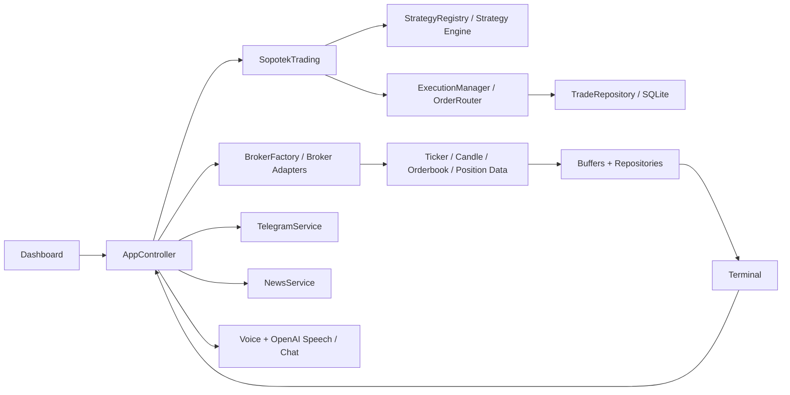

# Sopotek Trading AI

<p align="center">
  
</p>

Sopotek Trading AI is a desktop trading workstation built by Sopotek Corporation. It combines broker connectivity, live charting, manual and AI-assisted execution, order and position tracking, backtesting, operational safety tooling, Telegram integration, and OpenAI-assisted workflows in one PySide6 application.

## Version And Status

- Package version: `0.1.0`
- Company: `Sopotek Corporation`
- Product state: feature-rich early production-style desktop build
- Safety posture: live-capable, but still best validated through `paper`, `practice`, or `sandbox` sessions before any meaningful live capital use

## What The App Includes

- Dashboard for broker selection, mode, credentials, strategy choice, licensing, and launch control
- Terminal workspace with chart tabs, detachable charts, tiled/cascaded layouts, and layout restore
- MT4/MT5-style chart handling including candlesticks, indicators, orderbook heatmap, Fibonacci, and chart trading interactions
- Manual trade ticket with broker-aware formatting, suggested SL/TP, and chart-linked entry, stop, and take-profit levels
- AI trading controls, AI signal monitor, recommendations, Market ChatGPT, news overlays, and Telegram command handling
- Open orders, positions, trade log, closed journal, trade review, position analysis, performance analytics, and system health tools
- Risk and behavior protection including risk profiles, behavior guard, kill switch, drawdown-aware restrictions, and session health status
- Backtesting, strategy optimization, journaling, trade checklist workflow, and local persistence through SQLite and QSettings

## Key Workflows

### Operator Workflow
1. Launch from the dashboard.
2. Select broker, mode, and strategy.
3. Open one or more charts.
4. Use the `Trade Checklist` and `Trade Recommendations` windows before placing risk.
5. Place a manual order or enable AI trading only after confirming status, balances, and data quality.
6. Monitor `Trade Log`, `Open Orders`, `Positions`, `System Status`, `Behavior Guard`, and `Performance`.
7. Review trades later in `Closed Journal`, `Trade Review`, and `Journal Review`.

### Remote Workflow
- Receive Telegram notifications for trade activity.
- Use Telegram commands and keyboard shortcuts for status, balances, screenshots, chart captures, recommendations, and position analysis.
- Ask Market ChatGPT questions inside the app or through Telegram.

### Suggested First Validation Path
1. Launch in `paper`, `practice`, or `sandbox`.
2. Open one symbol and confirm candles, ticker, and orderbook behavior.
3. Place one very small manual order.
4. Confirm `Trade Log`, `Open Orders`, `Positions`, and `Closed Journal` update in a consistent way.
5. Test `Market ChatGPT`, Telegram, and screenshots only after the broker session is healthy.
6. Enable AI trading only after manual execution and review workflows are behaving as expected.

## Architecture At A Glance



## Supported Modes And Brokers

### Modes
- `paper`: local simulation path
- `practice` or `sandbox`: broker-side test environments where supported
- `live`: real broker execution

### Broker Families
- `crypto` through `CCXTBroker`
- `forex` through `OandaBroker`
- `stocks` through `AlpacaBroker`
- `paper` through `PaperBroker`
- `stellar` through `StellarBroker`

## Recommended Local Setup

### 1. Create A Virtual Environment
```powershell
python -m venv .venv
.\.venv\Scripts\activate
python -m pip install --upgrade pip
python -m pip install -r requirements.txt
```

### 2. Launch The Desktop App
```powershell
python src\main.py
```

### 3. Start Safely
1. Open the dashboard.
2. Choose broker type, exchange, and mode.
3. Start with `paper`, `practice`, or `sandbox`.
4. Confirm symbols, candles, balances, positions, and open orders.
5. Test the manual order flow before enabling AI trading.
6. Validate Telegram or OpenAI integration only after the core trading path is stable.
7. Use `live` only when the same workflow is already behaving correctly in a non-production session.

## Documentation Map

- [Getting Started](docs/getting-started.md)
- [Full App Guide](docs/FULL_APP_GUIDE.md)
- [Architecture](docs/architecture.md)
- [Strategies](docs/strategy_docs.md)
- [Brokers And Modes](docs/brokers-and-modes.md)
- [UI Workspace Guide](docs/ui-workspace.md)
- [Integrations](docs/integrations.md)
- [Internal API Notes](docs/api.md)
- [Testing And Operations](docs/testing-and-operations.md)
- [Troubleshooting](docs/troubleshooting.md)
- [Development Notes](docs/development.md)

## Built-In Command Surfaces

### Telegram
The bot can handle:

- status, balances, positions, and open orders
- screenshots and chart screenshots
- recommendation and performance summaries
- plain-text ChatGPT conversations in addition to slash commands

### Market ChatGPT
The in-app assistant can:

- answer questions about balances, positions, performance, journal state, and recommendations
- open windows such as `Settings`, `Position Analysis`, `Closed Journal`, and `Performance`
- manage Telegram state
- place, cancel, or close trades through confirmation-gated commands
- listen and speak when voice support is configured

## Testing

Run the full suite:

```powershell
python -m pytest src\tests -q
```

Run a focused subset:

```powershell
python -m pytest src\tests\test_execution.py src\tests\test_other_broker_adapters.py src\tests\test_storage_runtime.py -q
```

## Packaging And Docs

Build package artifacts:

```powershell
python -m build
```

Build documentation site:

```powershell
python -m mkdocs build -f docs\mkdocs.yml
```

Serve docs locally:

```powershell
python -m mkdocs serve -f docs\mkdocs.yml
```

## Storage And Runtime Files

- Local database: `data/sopotek_trading.db`
- Logs: `logs/` and `src/logs/`
- Generated screenshots: `output/screenshots/`
- Detached chart layouts and most operator preferences: persisted through `QSettings`
- Generated reports and artifacts: `src/reports/`, `output/`, and other runtime output folders depending on workflow

## Safety Notes

- The application can route live orders when the broker session is configured for live execution.
- Behavior guard, risk profiles, and the kill switch are protection layers, not guarantees of profitability.
- Rejected broker orders, including low-margin or insufficient-funds cases, are surfaced back into the UI and logging paths.
- Always validate symbol precision, size rules, and venue permissions with the actual broker before risking live capital.

## License

`Proprietary - Sopotek Corporation` as declared in [pyproject.toml](pyproject.toml).
